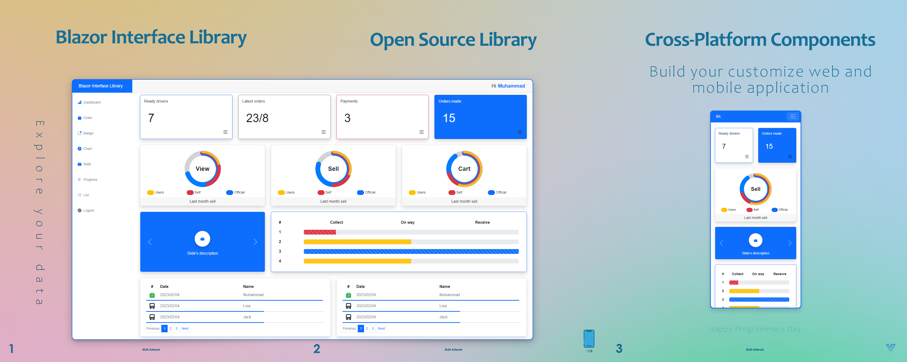

# Blazor Interface Library (BIL)
Blazor Interface Library (BIL) is an open-source collection of reusable Razor components designed to help .NET developers build modern, responsive, and cross-platform web applications quickly and efficiently using Blazor and C# only — no need for JavaScript or external UI frameworks.

# 🌟 Key Features
•	✅ Built entirely with C# and Razor
 
•	✅ Five main components for displaying data and submitting forms
 
•	✅ Mobile-first & responsive design
 
•	✅ Easily integrable into existing Blazor Server or Blazor WebAssembly projects
 
•	✅ Fully customizable components
 
•	✅ Open-source and ready to extend

# 📦 Use Cases
BIL is ideal for: 
1.	Data Dashboards 
Visualize analytics, KPIs, and system performance with clean and responsive charts and cards.
2.	Form-Based Applications 
Create fast, customizable input forms for managing business data or collecting user input.
3.	Machine Learning Interfaces 
Use BIL to visualize ML model results, outputs, or predictions for AI dashboards.
4.	Admin Panels 
Quickly scaffold internal tools with consistent UI and efficient development cycles.
5.	IoT/Robotics Control UIs 
Monitor and interact with hardware state (e.g., robot telemetry) using live-updating UI components.
6.	Startup MVPs 
Rapidly prototype business ideas with fully C#-based UI that scales with the product.

# 🚀 Getting Started
Clone the project by running the command bellow: 
git clone https://github.com/mjn110/Bil.git

# 📚 Components
<table>
  <tr>
    <td><strong>Component Name</strong></td>
    <td><strong>Description</strong></td>
  </tr>
  <tr>
    <td>List</td>
    <td>Demonstrate data given as list with pagination</td>
  </tr>
  <tr>
    <td>Chart</td>
    <td>Displays circular and bar charts for data visualization</td>
  </tr>
  <tr>
    <td>Badge</td>
    <td>Badge component for highlighting counts or tags</td>
  </tr>
  <tr>
    <td>Form</td>
    <td>Flexible form builder for data input</td>
  </tr>
  <tr>
    <td>Progress</td>
    <td>Shows the progress of different tasks</td>
  </tr>
</table>

# 🛠 Technologies Used
•	Blazor (WebAssembly & Server) 
•	C# 
•	.NET Core / .NET 6+ 
•	Razor Components

# 🤝 Contributing
Contributions are welcome! If you'd like to: 
•	Add a new component 
•	Improve documentation 
•	Fix bugs or issues 
Please open an issue or submit a pull request.

# 🙌 Support
If you find this project useful, please consider starring ⭐ the repository to show your support! 
For collaboration, questions, or support, feel free to <a href="https://github.com/mjn110/Bil/issues">open an issue</a> or contact me via <a href="https://www.linkedin.com/in/mj-najafi">LinkedIn</a> or email.
